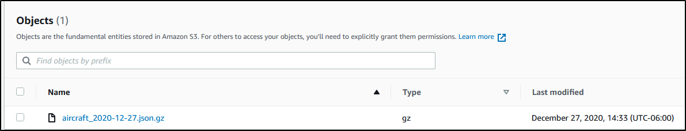

= PiAware Parser 
joshua.faust@sevrosecurity.com
:toc:

If you're using dump1090-fa on a Raspberry Pi to track aircraft movement, this package allows you to save aircraft information to your local system and/or AWS S3. 

Functionality to enrich your data with the https://rapidapi.com/adsbx/api/adsbexchange-com1/pricing[ADSBechanage API] has also been added.

== How it works

Flight aware uses a dynamic json file `/run/dump1090-fa/aircraft.json` which is the base information you will see within your SkyAware Web dashboard. This package reads the data from the file, writes the data to a persistent gzipped CSV file, and continually checks for changes within `aircraft.json`. 

Essentially:

. Read `aircraft.json`
. Check if user has requested to use https://rapidapi.com/adsbx/api/adsbexchange-com1/pricing[ADSBexchange API].
.. This is to enrich the data if you do have access. 
. Write GZIPPED CSV data to a persistent file.
.. Filename is: `aircraft_<date>.csv.gz`
. Check if `aircraft.json` has new data.

== Additional API's

I've added some optional and configurable APIs if the user wants to use them. These are all turned off by default and are enabled via CLI flags. 

=== ADSB Exchange API
[%collapsible]
====

https://rapidapi.com/adsbx/api/adsbexchange-com1/pricing[ADSBexchange API] allows us to enrich the local aircraft data from `aircraft.json` with several new fields. To fully utilize this API, you will need to purchase a monthly license which, will give you an API key that you can add to `secrets.conf`.

Here is an example of not enriched and enriched:

.Not Enriched
[source, json]
----
{
    "epoch": 1609112746.1,
    "icao": "ac6364",
    "ident": "DAL1936",
    "alt_baro": "11025",
    "alt_geom": "10475",
    "track": "4.5",
    "lat": "44.350596",
    "lon": "-93.20506"
}
----

.Enriched
[source, json]
----
{
    "epoch": 1609112746.1,
    "icao": "ac6364",
    "ident": "DAL1936",
    "alt_baro": "11025",
    "alt_geom": "10475",
    "track": "4.5",
    "lat": "44.350596",
    "lon": "-93.20506",
    "ac": [
        {
            "postime": "1609112744641",
            "icao": "AC6364",
            "reg": "N898DN",
            "type": "B739",
            "wtc": "2",
            "spd": "309.9",
            "altt": "0",
            "alt": "11050",
            "galt": "11060",
            "talt": "7008",
            "lat": "44.348877",
            "lon": "-93.205261",
            "vsit": "0",
            "vsi": "-1152",
            "trkh": "0",
            "ttrk": "0",
            "trak": "4.4",
            "sqk": "6137",
            "call": "DAL1936",
            "gnd": "0",
            "trt": "5",
            "pos": "1",
            "mlat": "0",
            "tisb": "0",
            "sat": "0",
            "opicao": "DAL",
            "cou": "United States",
            "mil": "0",
            "interested": "0",
            "from": "LGA La Guardia New York United States",
            "to": "BOS General Edward Lawrence Logan Boston United States"
        }
    ],
    "total": 1,
    "ctime": 1609112746914
}
----
====

=== AWS API
[%collapsible]
====
I've build is AWS S3 saving capability. All you need to provide is your AWS account `Access_Key` and `Secret_key` within `secrets.conf` and supply the CLI `--s3` argument to tell the program to save data to S3. 

====

=== Twilio API
[%collapsible]
====
https://www.twilio.com[Twilio] allows us to send our phones text messages. In this case, a text message is sent to you phone when:

* The script is started
* After an internet connection outage has been remediated
* Every hour to let you know your system is functioning properly.

There are certainly more use cases for this in the future but, the main purpose is to let you know if/when your system breaks or goes down. 

To configure Twilio, you'll need to purchase a number and add the following to `secrets.conf`

[source, conf]
----
account_sid = <twilio_account_sid>
auth_token = <twilio_auth_token>
to_phone_number = <Your Cell Phone Number (i.e. 1234567890)>
from_phone_number = <Your Twilio Number (i.e. 1234567890)>
----

====

== How to use

* Python 3.7+
* `pip install -r requirements.txt`
* If you're going to use the ADSBexchange API, make sure to add you API key to `secrets.conf`
* If you want to upload your files to AWS S3, add your credentials to `secrets.conf`

[source, text]
----
usage: backup_aircraft.py [-h] [-a] [-s] [-t]

optional arguments:
  -h, --help    show this help message and exit
  -a, --useapi  Use the FlightAware V3 api to enrich aircraft data
  -s, --s3      Upload compressed flight data to S3
  -t, --twilio  Use Twilio to send text messages for outages and uptime info
----
